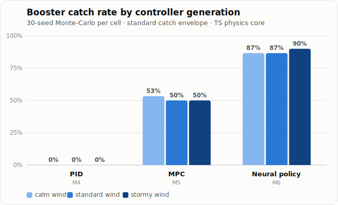

# Starship Catch Simulator

<!-- hero catch GIF goes here — SLS-64 -->

[](https://github.com/DionisMuzenitov/starship-catch-sim/actions/workflows/ci.yml)
[](https://github.com/DionisMuzenitov/starship-catch-sim/actions/workflows/deploy.yml)

**▶ Live demo: <https://dionismuzenitov.github.io/starship-catch-sim/>** — manual flight, PID guidance, all scenarios, replay, and the Monte-Carlo evaluator run entirely in your browser. (MPC guidance needs a local service — see [Running MPC locally](#running-mpc-locally).)

> Work is tracked in Jira: [SLS board](https://yanismuzenitov.atlassian.net/jira/software/projects/SLS/boards/67).

## Pitch

A real-time, 6-DOF simulation of SpaceX's Starship booster catch manoeuvre — and a test bench for the guidance that flies it. The headline result: an **imitation-learned neural policy that catches the booster 87–90 % of the time, versus 50 % for a convex-MPC baseline**, running a pure-TypeScript forward pass entirely in your browser. The simulator models rigid-body dynamics, Mach-dependent aero, grid-fin and engine-gimbal control, and the tower ("Mechazilla") catch mechanism, so you can fly it by hand, pit PID / MPC / neural controllers against each other, and benchmark them over seeded Monte-Carlo dispersions.

### Who this is for

This is a **portfolio project** — a from-scratch 6-DOF flight simulator and controls test-bench built to demonstrate end-to-end engineering judgment: real vehicle physics, three generations of guidance (PID → convex MPC → an imitation-learned neural policy that catches 87–90 % of the time in the browser), and the decision trail behind every non-trivial choice (the [ADR index](docs/adr/)). It's built to be evaluated by engineers and hiring managers for depth and follow-through, and to be enjoyable for the RL/GNC-curious and the SpaceX community.

## Results

Three controller generations, benchmarked on the TypeScript physics core (250 Hz) across the three `booster-descent-*` wind scenarios — 30 seeded Monte-Carlo runs per cell against the standard catch envelope (10 m / 5 m·s⁻¹ vertical / 2 m·s⁻¹ horizontal / 3° tilt / 5°·s⁻¹):

| Controller             | Calm     | Standard | Stormy   |
| ---------------------- | -------- | -------- | -------- |
| Cascaded PID (M4)      | 0 %      | 0 %      | 0 %      |
| Convex MPC (M5)        | 53 %     | 50 %     | 50 %     |
| **Neural policy (M6)** | **87 %** | **87 %** | **90 %** |



_Progression across controller generations (regenerate with `pnpm chart:progression` from the committed [gate records](eval/results/gate-records/MANIFEST.md))._

The shipped policy is a 578 KB, 17→256→256→4 tanh MLP. It runs a dependency-free TypeScript forward pass in the browser (no ONNX, no WASM — [ADR-016](docs/adr/016-ts-policy-runtime.md)), commanding thrust and lean targets at 25 Hz over a 250 Hz body-frame attitude-PD inner loop — the same guidance/control layering real boosters use. It is **imitation-learned** (behaviour cloning on a scripted-cascade teacher), _not_ RL-trained: direct PPO and SAC never produced a catching policy at laptop compute, and that honest diagnosis trail is part of the write-up. TypeScript↔Python parity is CI-tested to 1e-4 on every push.

Reproduce the benchmark with `pnpm bench:rl` (30 seeds). Full protocol, per-scenario accuracy/fuel, provenance, and caveats (e.g. the stormy profile was never trained on): **[controller comparison report →](eval/reports/v1-controller-comparison.md)**.

## Quick start

```bash
# Prerequisites: Node 20+, pnpm 9+
git clone <repo-url> && cd starship-catch-sim

pnpm install          # install all workspace dependencies
pnpm dev              # start every package in dev/watch mode
```

Open <http://localhost:5173> (default Vite port) to see the web app.

## Repo layout

```
starship-catch-sim/
├── apps/
│   └── web/              # Browser front-end (React + React-Three-Fiber)
├── packages/
│   ├── physics/          # 6-DOF dynamics, integrators, environment models
│   └── controllers/      # Manual, cascaded-PID, MPC & neural (RL) controllers + eval harness
├── services/
│   ├── mpc/              # Convex-MPC guidance service (FastAPI + CVXPY/Clarabel)
│   └── rl/               # RL / imitation-learning pipeline (gym env, numpy physics port, training)
├── tools/                # Benchmarks + Monte-Carlo eval scripts (bench:rl, bench:mpc)
├── eval/                 # Benchmark reports, result JSONs & plots
├── docs/                 # ADRs, reward & dynamics notes, reference data
├── pnpm-workspace.yaml
└── package.json          # Root workspace scripts
```

## Running MPC locally

The MPC controller is guided by a Python SOCP service (`services/mpc`,
FastAPI + CVXPY/Clarabel) that a static host can't run — so on the
[live demo](https://dionismuzenitov.github.io/starship-catch-sim/) the MPC
option is marked **(local)** and flies the PID baseline instead (a banner
explains this; no errors, everything else works). To drive the real MPC
guidance, run the service alongside the web app locally:

```bash
pnpm dev:full             # vite dev server + uvicorn on :8100 (needs uv)
```

The web app auto-detects the service at `http://localhost:8100`; override
with `VITE_MPC_URL=<url>` (set it empty, `VITE_MPC_URL=`, to force the
PID-fallback demo mode). A browser-native MPC (WebAssembly) that removes
the service dependency is tracked as ADR-008 / SLS-31.

## Milestones

| Milestone | Description                                                                                | Status     |
| --------- | ------------------------------------------------------------------------------------------ | ---------- |
| M1        | Physics core: 6-DOF dynamics, atmosphere, Mach-dependent drag                              | Done       |
| M2        | 3-D visualisation: tower, HUD, cameras, replays                                            | Done       |
| M3        | Sim runner, catch detection, manual flight                                                 | Done       |
| M4        | Cascaded-PID baseline + tuning panel + Monte-Carlo evaluator                               | Done       |
| M5        | Convex MPC guidance (SOCP/SCvx service + client + benchmarks)                              | Done¹      |
| M6        | RL: gym env, numpy physics port, imitation-learned neural policy, in-browser inference     | Done²      |
| M7        | Hosted demo, leaderboard, docs site, write-up                                              | Demo live³ |
| M8        | Visual environment: Earth terrain, launch tower, engine plumes, camera & performance tiers | Planned    |

¹ MPC infrastructure is shipped and verified; the catch-capability exit
gate (coast-phase ignition planning) met on 2026-07-05 (≥50 % catch, SLS-47).

² Gate met on 2026-07-09 (SLS-30): the in-browser neural policy catches
**87 / 87 / 90 %** (calm/standard/stormy, 30 seeds, `pnpm bench:rl`) versus
MPC's 53 / 50 / 50 % — see [Results](#results).

³ The static [live demo](https://dionismuzenitov.github.io/starship-catch-sim/)
is deployed (SLS-49, pulled forward from M7); leaderboard, replay-verification
server, and docs site remain planned (SLS-31/32/33).

## Deep dives

The engineering-judgment trail lives in the [Architecture Decision Records](docs/adr/README.md) — _why_ each non-trivial choice was made, and what was rejected. A few flagships:

- **[ADR-007](docs/adr/007-convex-mpc-guidance.md) → [ADR-009](docs/adr/009-coast-burn-guidance.md)** — why the first MPC formulation could never close a metres-scale catch through seconds-scale attitude lag, and the coast-phase ignition planning that fixed it.
- **[ADR-013](docs/adr/013-rl-numpy-port-and-parity.md)** — the numpy↔TypeScript physics port: single-sourced constants and CI-enforced parity, so the RL env and the browser fly the same dynamics.
- **[ADR-015](docs/adr/015-attitude-inner-loop-and-bc-campaign.md) / [ADR-016](docs/adr/016-ts-policy-runtime.md)** — the two-rate control stack (25 Hz policy over a 250 Hz attitude loop) and shipping the neural policy as self-describing JSON weights with a ~30-line pure-TS runtime.

Reference material: [reward & imitation-learning design](docs/rl-reward.md) · [dynamics notes](docs/dynamics.md) · [physical reference data](docs/reference/README.md) · [controller comparison report](eval/reports/v1-controller-comparison.md).

## License

This project is licensed under the [MIT License](./LICENSE).
