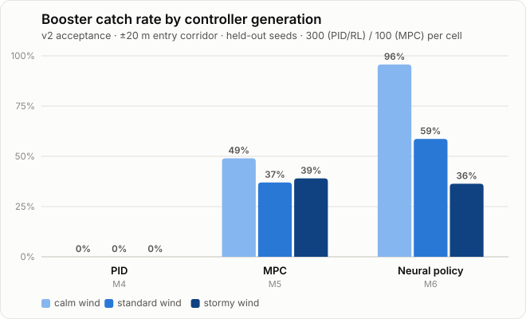

# Starship Catch Simulator

<!-- Placeholder hero clip (SLS-64): a live in-browser catch — the imitation-learned
     neural policy flying Booster Descent (calm), cinematic camera, HUD on. To be
     replaced by SLS-33's polished cinematic. Regenerate: record a catch, then
     `ffmpeg -ss <t> -t 10.5 -i rec.mov -vf "fps=12,scale=720:-2:flags=lanczos,split[a][b];[a]palettegen=max_colors=160:stats_mode=diff[p];[b][p]paletteuse=dither=bayer:bayer_scale=5" -loop 0 docs/media/catch.gif` -->
<p align="center">
  
</p>

[](https://github.com/DionisMuzenitov/starship-catch-sim/actions/workflows/ci.yml)
[](https://github.com/DionisMuzenitov/starship-catch-sim/actions/workflows/deploy.yml)

**▶ Live demo: <https://dionismuzenitov.github.io/starship-catch-sim/>** — manual flight, PID guidance, all scenarios, replay, and the Monte-Carlo evaluator run entirely in your browser. (MPC guidance needs a local service — see [Running MPC locally](#running-mpc-locally).)

**📖 Docs: <https://dionismuzenitov.github.io/starship-catch-sim/docs/>** — physics derivations, how each controller works, the ADR index, benchmarks, and a "[write your own controller](https://dionismuzenitov.github.io/starship-catch-sim/docs/api/controllers)" guide.

> Work is tracked in Jira: [SLS board](https://yanismuzenitov.atlassian.net/jira/software/projects/SLS/boards/67).

## Pitch

A real-time, 6-DOF simulation of SpaceX's Starship booster catch manoeuvre — and a test bench for the guidance that flies it. The honest headline, from a _held-out, domain-randomized_ acceptance benchmark: **no single controller wins.** An imitation-learned neural policy catches the booster **96 %** of the time when it arrives near-nominal in calm air, but wind and entry dispersion pull it down — and a convex-MPC re-planner, far more weather-robust, overtakes it once conditions get messy. The simulator models rigid-body dynamics, Mach-dependent aero, grid-fin and engine-gimbal control, and the tower ("Mechazilla") catch mechanism, so you can fly it by hand, pit PID / MPC / neural controllers against each other, and benchmark them over seeded Monte-Carlo dispersions.

### Who this is for

This is a **portfolio project** — a from-scratch 6-DOF flight simulator and controls test-bench built to demonstrate end-to-end engineering judgment: real vehicle physics, three generations of guidance (PID → convex MPC → an imitation-learned neural policy), all held to a _held-out, domain-randomized_ acceptance benchmark, and the decision trail behind every non-trivial choice (the [ADR index](docs/adr/)). It's built to be evaluated by engineers and hiring managers for depth and follow-through, and to be enjoyable for the RL/GNC-curious and the SpaceX community.

> **Provenance & scope.** The sim models the **booster** catch on the flight-proven **V1/V2** interface (pins under the fins — the only configuration ever caught, Flights 5/7/8). A **ship** catch has never been flown: the first attempt was announced for **Flight 14** (2026-07-25, also Starship's first orbital flight), so the sim's ship envelope is **speculative**, modeled by analogy. The vehicle flying now is **V3** — three larger grid fins that _are_ the catch interface, a 13→5→3 landing burn — one generation ahead of what the sim models. Full record + sources: **[catch provenance](docs/catch-provenance.md)**.

## Results

**No single controller wins** — that is the honest finding. On a _held-out, domain-randomized_ acceptance benchmark (per-run wind + full-state entry dispersion, seeds drawn from a reserved band the training never sees — [SLS-97](https://yanismuzenitov.atlassian.net/browse/SLS-97) / [ADR-024](docs/adr/024-acceptance-evaluation-harness.md)), the three controller generations **cross over**: the learned policy owns the calm, near-nominal corner, while the convex-MPC re-planner is far more robust to wind and dispersion and overtakes it once either appears.

Headline numbers at the **±20 m entry-corridor reference width** (1σ position; 300 seeds PID/RL, 100 MPC, catch judged against the standard envelope — 10 m / 5 m·s⁻¹ vert / 2 m·s⁻¹ horiz / 3° tilt / 5°·s⁻¹; Wilson 95 % CIs in the report):

| Controller             | Calm     | Standard | Stormy   |
| ---------------------- | -------- | -------- | -------- |
| Cascaded PID (M4)      | 0 %      | 0 %      | 0 %      |
| Convex MPC (M5)        | 49 %     | 37 %     | 39 %     |
| **Neural policy (M6)** | **96 %** | **59 %** | **36 %** |

The policy peaks at 96 % in calm air, but its windy columns sit far below the old fixed-wind “87 / 87 / 90 %” bench — that gap is precisely the overfitting a fresh, held-out benchmark exposes (the old runs reused one frozen gust sequence). Widen the entry corridor beyond ±20 m and every controller degrades while MPC pulls ahead in wind; the full **catch-rate-vs-dispersion-width** curve — the real story — is in the [controller comparison report](eval/reports/v1-controller-comparison.md).

**Why PID scores 0 % — the result, not a strawman.** A cascaded PID is a pure _tracking_ law with no energy or ignition management: it can hold attitude but never decides _when_ to burn, so its median terminal miss is **3.5–5.5 km** (see the [terminal-accuracy table](eval/reports/v1-controller-comparison.md#median-terminal-accuracy--fuel-successful-rl-runs-land-pid-never-does)). The booster catch is fundamentally an ignition-planning problem — exactly what the MPC plans and what the neural policy absorbed from its scripted teacher. The 0 % is the baseline's honest floor, and it frames why the other two are hard-won.



_v2 acceptance at the ±20 m reference width (regenerate with `pnpm chart:progression` from the committed [gate records](eval/results/gate-records/MANIFEST.md))._

The shipped policy is a 578 KB, 17→256→256→4 tanh MLP. It runs a dependency-free TypeScript forward pass in the browser (no ONNX, no WASM — [ADR-016](docs/adr/016-ts-policy-runtime.md)), commanding thrust and lean targets at 25 Hz over a 250 Hz body-frame attitude-PD inner loop — the same guidance/control layering real boosters use. It is **imitation-learned** (behaviour cloning on a scripted-cascade teacher), _not_ RL-trained: direct PPO and SAC never produced a catching policy at laptop compute, and that honest diagnosis trail is part of the write-up. TypeScript↔Python parity is CI-tested to 1e-4 on every push.

Reproduce with `pnpm campaign:v2` (the held-out acceptance sweep). Full protocol, the catch-rate-vs-width curve, Wilson CIs, provenance, and caveats: **[controller comparison report →](eval/reports/v1-controller-comparison.md)**.

## What's modeled — and what's not

Precisely: **6-DOF rigid-body dynamics** integrated at 250 Hz with **Mach-dependent table aero** (drag and grid-fin/flap authority interpolated over a coefficient table across the sub/transonic/supersonic regimes — not a constant Cd), **variable mass, CoM and inertia** as propellant burns, **inner-13 engine gimbal + grid-fin** control, **layered wind + Dryden turbulence**, and the **tower catch geometry** with an explicit capture envelope. TypeScript ↔ Python physics parity is CI-tested to 1e-4 on every push.

**Not modeled (yet), stated plainly:** no CFD — aero is table-interpolated, not resolved; no offshore-divert / abort-to-water profile ([SLS-103](https://yanismuzenitov.atlassian.net/browse/SLS-103)); no ship (upper-stage) catch — the booster catch only, and its envelope is grounded while the ship's is speculative ([SLS-99](https://yanismuzenitov.atlassian.net/browse/SLS-99)); the MPC plan is **wind-blind and local-only** ([SLS-116](https://yanismuzenitov.atlassian.net/browse/SLS-116)); no structural, thermal, or propellant-slosh dynamics. These are boundaries by design, not gaps we hide.

## Quick start

```bash
# Prerequisites: Node 20+, pnpm 9+
git clone <repo-url> && cd starship-catch-sim

pnpm install          # install all workspace dependencies
pnpm dev              # start every package in dev/watch mode
```

Open <http://localhost:5173> (default Vite port) to see the web app.

## Repo layout

```
starship-catch-sim/
├── apps/
│   └── web/              # Browser front-end (React + React-Three-Fiber)
├── packages/
│   ├── physics/          # 6-DOF dynamics, integrators, environment models
│   └── controllers/      # Manual, cascaded-PID, MPC & neural (RL) controllers + eval harness
├── services/
│   ├── mpc/              # Convex-MPC guidance service (FastAPI + CVXPY/Clarabel)
│   └── rl/               # RL / imitation-learning pipeline (gym env, numpy physics port, training)
├── tools/                # Benchmarks + Monte-Carlo eval scripts (bench:rl, bench:mpc)
├── eval/                 # Benchmark reports, result JSONs & plots
├── docs/                 # ADRs, reward & dynamics notes, reference data
├── pnpm-workspace.yaml
└── package.json          # Root workspace scripts
```

## Running MPC locally

The MPC controller is guided by a Python SOCP service (`services/mpc`,
FastAPI + CVXPY/Clarabel) that a static host can't run — so on the
[live demo](https://dionismuzenitov.github.io/starship-catch-sim/) the MPC
option is marked **(local)** and flies the PID baseline instead (a banner
explains this; no errors, everything else works). To drive the real MPC
guidance, run the service alongside the web app locally:

```bash
pnpm dev:full             # vite dev server + uvicorn on :8100 (needs uv)
```

The web app auto-detects the service at `http://localhost:8100`; override
with `VITE_MPC_URL=<url>` (set it empty, `VITE_MPC_URL=`, to force the
PID-fallback demo mode). A browser-native MPC (WebAssembly) that removes
the service dependency is tracked as ADR-008 / SLS-31.

**Watch a recorded catch (no service needed).** So the static demo can _show_
what MPC actually does, two real catches are bundled in
[`apps/web/public/replays/`](apps/web/public/replays) — one **MPC** and one
**neural** — recorded headlessly under bench-valid conditions
(`tools/eval/gen-demo-replays.ts`). In the demo the MPC fallback banner has a
**“▶ Watch a recorded MPC catch”** button; or use **Load replay** in the
scenario picker to load either file.

## Milestones

| Milestone | Description                                                                                | Status     |
| --------- | ------------------------------------------------------------------------------------------ | ---------- |
| M1        | Physics core: 6-DOF dynamics, atmosphere, Mach-dependent drag                              | Done       |
| M2        | 3-D visualisation: tower, HUD, cameras, replays                                            | Done       |
| M3        | Sim runner, catch detection, manual flight                                                 | Done       |
| M4        | Cascaded-PID baseline + tuning panel + Monte-Carlo evaluator                               | Done       |
| M5        | Convex MPC guidance (SOCP/SCvx service + client + benchmarks)                              | Done¹      |
| M6        | RL: gym env, numpy physics port, imitation-learned neural policy, in-browser inference     | Done²      |
| M7        | Hosted demo, leaderboard, docs site, write-up                                              | Demo live³ |
| M8        | Visual environment: Earth terrain, launch tower, engine plumes, camera & performance tiers | In progress⁴ |

¹ MPC infrastructure is shipped and verified; the catch-capability exit
gate (coast-phase ignition planning) met on 2026-07-05 (≥50 % catch, SLS-47).

² Gate met on 2026-07-09 (SLS-30): the in-browser neural policy cleared the M6
catch-rate gate on the then-current fixed-wind bench. The **current** figures,
re-measured on the held-out domain-randomized v2 acceptance benchmark, are in
[Results](#results).

³ The static [live demo](https://dionismuzenitov.github.io/starship-catch-sim/)
is deployed (SLS-49, pulled forward from M7) and the
[docs site](https://dionismuzenitov.github.io/starship-catch-sim/docs/) is live
(SLS-32); leaderboard and replay-verification server remain planned
(SLS-31/33).

⁴ Shipped: Earth terrain (SLS-57), Mechazilla tower (SLS-76), engine-plume VFX
(SLS-60), the full six-mode camera system incl. a cinematic auto-director
(SLS-58/59), and quality tiers + a perf HUD (SLS-61). The **≥ 60 fps** perf
outcome gate is **met** on the reference laptop at the default tier
(`docs/reference/perf-budget.md`). Remaining before M8 closes: the demo-grade
screenshot / hero-GIF set (SLS-64/33).

## Deep dives

The engineering-judgment trail lives in the [Architecture Decision Records](docs/adr/README.md) — _why_ each non-trivial choice was made, and what was rejected. A few flagships:

- **[ADR-007](docs/adr/007-convex-mpc-guidance.md) → [ADR-009](docs/adr/009-coast-burn-guidance.md)** — why the first MPC formulation could never close a metres-scale catch through seconds-scale attitude lag, and the coast-phase ignition planning that fixed it.
- **[ADR-013](docs/adr/013-rl-numpy-port-and-parity.md)** — the numpy↔TypeScript physics port: single-sourced constants and CI-enforced parity, so the RL env and the browser fly the same dynamics.
- **[ADR-015](docs/adr/015-attitude-inner-loop-and-bc-campaign.md) / [ADR-016](docs/adr/016-ts-policy-runtime.md)** — the two-rate control stack (25 Hz policy over a 250 Hz attitude loop) and shipping the neural policy as self-describing JSON weights with a ~30-line pure-TS runtime.

Reference material: [reward & imitation-learning design](docs/rl-reward.md) · [dynamics notes](docs/dynamics.md) · [physical reference data](docs/reference/README.md) · [controller comparison report](eval/reports/v1-controller-comparison.md) · [full write-up](eval/reports/v1-write-up.md).

## Built with AI — disclosure

Built solo with heavy AI pair-programming (Claude Code). That's stated up front because it's visible in the commit log anyway — and because the interesting part isn't _that_ AI was used but _how_ it was kept honest. Every non-trivial decision is human-reviewed and recorded in the [ADR log](docs/adr/README.md) (two dozen decision records, **including the documented failures** — e.g. direct RL never converged at laptop compute, so the shipped policy is imitation-learned, [ADR-015](docs/adr/015-attitude-inner-loop-and-bc-campaign.md)). Results aren't asserted, they're **pinned**: every headline number traces to a committed [gate record](eval/results/gate-records/MANIFEST.md), and TypeScript ↔ Python physics parity is CI-tested on every push. If a claim looks wrong, the receipts are in the repo.

## License

This project is licensed under the [MIT License](./LICENSE).
